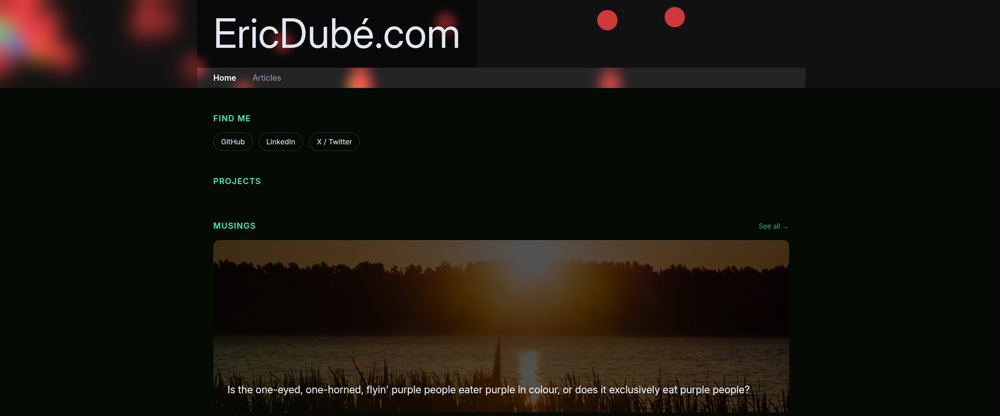

# Eric's Personal Website

This README.md file contains the instal/dev/build instructions
from the original README.md from the React Router generator.



### Installation

Install the dependencies:

```bash
npm install
```

### Development

Start the development server with HMR:

```bash
npm run dev
```

The website will be available at `http://localhost:5173`.

## Artifacts (claude-nexus)

The `/artifacts` pages are served from a local **claude-nexus** node running on
the same server (they used to come from Sanity). Two environment variables
configure the connection (used server-side only, never exposed to the browser):

- `NEXUS_URL` — the node's base URL (default `http://127.0.0.1:42067`).
- `NEXUS_TOKEN` — an `x-nexus-token` whose tokens.yaml grant includes read on `pub.artifacts` (or `**`), scoped to read `pub.artifacts`. Omit on a
  trusted-loopback dev node; required once the node enforces tokens.

## Building for Production

Create a production build:

```bash
npm run build
```

## Deployment

### Docker Deployment

To build and run using Docker:

```bash
docker build -t my-app .

# Run the container
docker run -p 3000:3000 my-app
```

### DIY Deployment

If you're familiar with deploying Node applications, the built-in app server is production-ready.

Make sure to deploy the output of `npm run build`

```
├── package.json
├── package-lock.json (or pnpm-lock.yaml, or bun.lockb)
├── build/
│   ├── client/    # Static assets
│   └── server/    # Server-side code
```

---

Built with ❤️,😡,🥲,🤨,😵‍💫,🤯,😱, and 🥱 using React Router.
